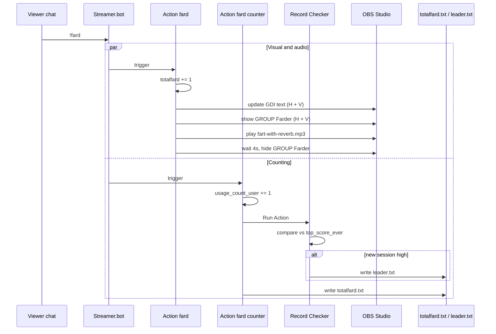
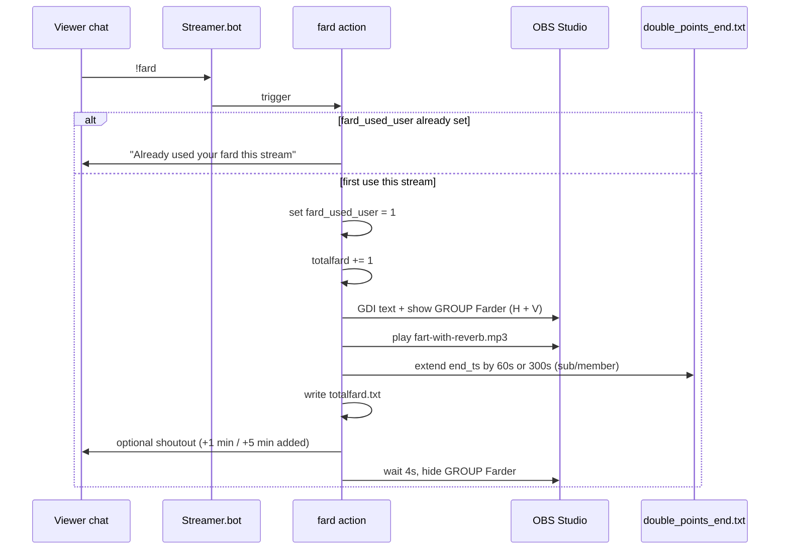

# Fard System

Once-per-stream community command: viewers use `!fard` once to flash OBS, play the sound, and **extend global 2× points** for everyone (+1 min regular, +5 min subs/members). No game code — Streamer.bot actions, OBS, and text files.

**Status:** Rework implemented in repo (July 2026). **Apply Streamer.bot changes:** [streamerbot-fard-rework-apply.md](streamerbot-fard-rework-apply.md). **Restore old fard:** import [`Lastest UI/streamerbot/fard-pre-rework-export.txt`](../Lastest%20UI/streamerbot/fard-pre-rework-export.txt).

**Related docs:** [streamerbot-points-from-scratch.md](streamerbot-points-from-scratch.md), [summon-march-system.md](summon-march-system.md), [youtube-description.md](youtube-description.md), [streaming-setup-guide.md](streaming-setup-guide.md).

---

## Overview

| Property | Value |
|----------|-------|
| **Platform** | Streamer.bot |
| **Action group** | `Commands` → **fard** (single action) |
| **Per stream** | One `!fard` per viewer (temp global `fard_used_%userName%`; SB restart resets) |
| **Reward** | Stack +1 or +5 min on `double_points_end.txt` (global 2× for all chat) |
| **OBS** | Horizontal + vertical HUD flash, `totalfard.txt` counter |

---

## Chat Commands

| Command | Aliases | Behavior |
|---------|---------|----------|
| `!fard` | — | Once per user: OBS + sound + extend 2× (silent stop if already used) |

`!topfarder` / `!farder`, `!myfards` / `!fardcount` removed.

---

## Actions (post-rework)

| Action | Trigger | Purpose |
|--------|---------|---------|
| **fard** | `!fard` | Gate, extend 2×, OBS, sound, `totalfard.txt` |

**Removed:** fard counter, Record Checker, TopfarderChecker, **myFardChecker** (`!myfards`, `!fardcount`).

Full Streamer.bot sub-action order: [streamerbot-fard-rework-apply.md](streamerbot-fard-rework-apply.md).

---

## Data

### Temp globals

| Variable | Purpose |
|----------|---------|
| `fard_used_%userName%` | `1` = already farded this stream |
| `totalfard` | Count of successful fards → `totalfard.txt` |

### Files

| File | Role |
|------|------|
| `Lastest UI/double_points_end.txt` | Unix end time; extended by each fard (+60s or +300s) |
| `totalfard.txt` | OBS session fard count |
| `Lastest UI/double_points_countdown.txt` | OBS text: `2x points: N min` (minutes only) |

Top farder / `leader.txt` no longer used. **Competitive personal 2×** moved to [summon march](summon-march-system.md) (`top_summoner.txt` via `!summon`).

---

## Points integration

- **Global 2×:** Fard extends the same timer as `!doublepoints`. Earn Points and passive read `IsDoublePointsActive`.
- **Sub/member 2× on earns:** Unchanged (separate from +5 min fard extension).
- **Multiplier (chat + passive):** `(doublePoints ? 2 : 1) × (subOrMember ? 2 : 1)` from fard/global timer and subs. **Top summoner 2×** is separate — see [summon-march-system.md](summon-march-system.md): `(doublePoints ? 2 : 1) × (topSummoner ? 2 : 1) × (subOrMember ? 2 : 1)`.

---

## Legacy (pre-rework)

Previously: unlimited `!fard`, session leaderboard, top farder personal 2× via `leader.txt`. See git history on this file for full old spec.

---

## Action Details (legacy reference — pre-rework)

### 1. fard

**Trigger:** Core → Commands → `fard` (`!fard`)

**Sub-actions (in order):**

1. Increment temp global `totalfard` by **1**
2. **OBS GDI Text** — `V - HUD :: TEXT - farder` (vertical layout)
3. **OBS GDI Text** — `HUD :: TEXT - farder` (horizontal layout)
4. **OBS Source Visibility** — `V - HUD :: GROUP - Farder` → **Visible**
5. **OBS Source Visibility** — `HUD :: GROUP - Farder` → **Visible**
6. **Play sound** — `fart-with-reverb.mp3` at **122%** volume
7. **Delay** — 4000 ms
8. **OBS Source Visibility** — `V - HUD :: GROUP - Farder` → **Hidden**
9. **OBS Source Visibility** — `HUD :: GROUP - Farder` → **Hidden**

**Behavior:** Each `!fard` bumps the session total, shows the farder HUD group on both OBS scenes for 4 seconds, plays the sound, then hides the groups again. GDI text sources update before the group is shown (triggering username on stream).

---

### 2. fard counter

**Trigger:** Core → Commands → `fard` (`!fard`) — runs in parallel with **fard**

**Sub-actions (in order):**

1. Increment temp global `usage_count_%userName%` by **1**
2. **Run Action** → **Record Checker**
3. Get temp global `totalfard` → local variable `totalfard`
4. **Write to file** → `totalfard.txt` (contents: `%totalfard%` or equivalent)
5. **Delay** — 4000 ms

**Behavior:** Tracks per-user usage for the session, checks for a new high score, persists the session total to disk for OBS, then waits 4 seconds (matches the HUD flash duration).

---

### 3. Record Checker

**Trigger:** None (0 triggers). Invoked only via **Run Action** from **fard counter**.

**Sub-actions:**

1. Get temp global `usage_count_%userName%` → `newCount`
2. Get temp global `top_score_ever` → `currentHigh` (default **0** if unset)
3. **If** `%newCount%` **Greater Than** `%currentHigh%`:
   - Set temp global `top_score_ever` to `%newCount%`
   - **Write to file** → `leader.txt`

**Behavior:** Session “leader” is whoever has the highest personal `usage_count_*` value. When someone beats the previous high, `leader.txt` is overwritten. There is no sub-action on the false branch.

**Write template** (confirmed in production):

```text
Top Farder: %userName% - %newCount%
```

`%userName%` uses Streamer.bot display casing; points compare case-insensitively.

---

### 4. myFardChecker *(removed)*

**Was:** `!myfards`, `!fardcount` — per-user fard count/status. **Deleted** in rework; only **`!fard`** remains (repeat use stops silently).

---

### 5. TopfarderChecker

**Trigger:** Core → Commands → `TopFarder` (`!topfarder`, `!farder`)

**Sub-actions:**

1. **Read Lines** from `leader.txt`
2. **If** `%commandSource%` equals (ignore case) `"youtube"`:
   - **YouTube Message** from variable `%line0%` (first line of file)
3. **If** `%commandSource%` equals (ignore case) `"twitch"`:
   - **Twitch Message** `%line0%`

**Behavior:** Echoes whatever is on line 0 of `leader.txt` into chat. Same file drives the points top-farder bonus.

---

## End-to-End Flow (`!fard`)



---

## OBS Assets

Both horizontal and vertical HUD scenes mirror the same fard UI:

| OBS path | Type | Role |
|----------|------|------|
| `HUD :: TEXT - farder` | GDI Text | Horizontal farder label |
| `HUD :: GROUP - Farder` | Group | Horizontal show/hide wrapper |
| `V - HUD :: TEXT - farder` | GDI Text | Vertical farder label |
| `V - HUD :: GROUP - Farder` | Group | Vertical show/hide wrapper |

**Audio:** `fart-with-reverb.mp3` (path configured in Streamer.bot sound sub-action).

**Text file sources:** OBS likely reads `totalfard.txt` elsewhere for a persistent on-stream total (separate from the 4-second flash group).

---

## Integration with Points System

The fard system is **loosely coupled** to chat points via `leader.txt` only. Fard counters and point balances are separate systems.

### How top farder 2× is detected

Both **Earn Points (chat)** and **Earn Points (passive)** use the same `IsTopFarder(userKey)` helper:

```csharp
const string TOP_FARDER_FILE = @"C:\Users\dalto\Documents\OBS files\textread\leader.txt";

// Reads full file, finds "Top Farder: " then username before " - "
// Returns true if username equals userKey (OrdinalIgnoreCase)
```

`userKey` is `%userName%` lowercased — the same key used in `viewer_points.txt`.

### Multiplier stacking (chat + passive)

Applied on every successful earn (after cooldown check):

```text
mult = (doublePoints ? 2 : 1) × (topFarder ? 2 : 1) × (subOrMember ? 2 : 1)
```

| Source | Base points | Cooldown | Notes |
|--------|-------------|----------|-------|
| Chat message | `POINTS_PER_MESSAGE` = **1** | 30 s (`COOLDOWN_SEC`) | Also assigns helper/hurter role for new users |
| Passive tick | `POINTS_PER_TICK` = **2** | 30 s, **shared** `lastEarn` | Only users already in `viewer_points.txt` |

Examples: top farder + subscriber during `!doublepoints` → 1 × 2 × 2 × 2 = **8** points per chat message.

`IsDoublePointsActive` reads `double_points_end.txt` (unix end timestamp). `IsSubscriberOrMember` checks Streamer.bot args `isSubscribed` (Twitch) or `userIsSponsor` (YouTube).

### What fard does *not* affect

- **`viewer_points.txt`** — no read/write from fard actions
- **`usage_count_*` / `totalfard`** — not used by points C#
- **Donation earns** — `points_command.py` can apply top-farder 2× only if Streamer.bot passes `[topFarder 1]` on the CLI; it does not read `leader.txt` itself unless wired in Streamer.bot

See [streamerbot-points-from-scratch.md § Configuration](streamerbot-points-from-scratch.md#configuration-edit-in-the-c-code) and [Cheer / Super Chat argument reference](streamerbot-points-from-scratch.md#cheer--super-chat--argument-reference).

---

### Current design traits

Intentional in production today; superseded by [planned rework](#planned-rework) when shipped:

1. **Session-scoped counts** — temp globals reset when Streamer.bot restarts.
2. **Split `!fard` actions** — **fard** + **fard counter** on the same trigger.
3. **No per-user limit** — unlimited `!fard` spam allowed.
4. **Session leader = top farder** — personal 2× via `leader.txt` for highest spam count.

---

## Planned rework (shipped)

Design decisions and checklist — repo changes **done**; paste Streamer.bot steps from [streamerbot-fard-rework-apply.md](streamerbot-fard-rework-apply.md).

### Approved decisions

| # | Decision |
|---|----------|
| 1 | **Remove top farder** — delete Record Checker, TopfarderChecker, `leader.txt` writes, and `IsTopFarder()` from all earn paths. |
| 2 | **No cap** on total 2× duration — community fards can stack arbitrarily long. |
| 3 | **Stream boundary** — Streamer.bot is restarted every stream; temp globals (`fard_used_*`) are sufficient; no extra stream-start reset action needed. |
| 4 | **Sub / member bonus** — Twitch `isSubscribed` or YouTube `userIsSponsor` → **+5 min** extension instead of +1 min. |
| 5 | **Keep `totalfard`** — session counter of successful fards, written to `totalfard.txt` for OBS. |

### Concept shift

| | Current | Planned |
|---|---------|---------|
| Uses per viewer | Unlimited | **Once per stream** |
| Reward | Leader gets personal 2× | **Global 2× timer extends** for all chat |
| Sub/member perk | 2× on their own point earns (separate system) | **+5 min** on their one fard (stacks with existing sub 2× on earns) |
| Competitive hook | `!topfarder` leaderboard | Cooperative — “use your fard to help everyone” |
| Scarcity | None | One charged ability per viewer |

---

### Commands (planned)

| Command | Status | Behavior |
|---------|--------|----------|
| `!fard` | **Keep, rework** | Once per user per stream → OBS + sound + extend 2× (silent on repeat) |
| `!topfarder` / `!farder` | **Remove** | No leaderboard |
| `!myfards` / `!fardcount` | **Remove** | Status command not needed |

Update [youtube-description.md](youtube-description.md) when shipped.

---

### Data model (planned)

#### Temp globals (Streamer.bot)

| Variable | Values | Purpose |
|----------|--------|---------|
| `fard_used_%userName%` | unset / `0` = available, `1` = used | Once-per-stream gate |
| `totalfard` | integer, +1 per successful fard | Session total fards → `totalfard.txt` |

**Remove:** `usage_count_%userName%`, `top_score_ever`.

#### Files

| File | Change |
|------|--------|
| `totalfard.txt` | **Keep** — unique fard count this stream |
| `double_points_end.txt` | **Extend** (read-modify-write) instead of only set by `!doublepoints` |
| `leader.txt` | **Stop writing**; remove reads from points C# / donation args |

#### Extension amounts

| User type | Detection | Seconds added |
|-----------|-----------|---------------|
| Regular | default | **60** (+1 min) |
| Twitch sub | `%isSubscribed%` = True | **300** (+5 min) |
| YouTube member | `%userIsSponsor%` = True | **300** (+5 min) |

Same variables already used in Earn Points C# for sub/member 2× on earns. If someone is both sub and member on one platform, treat as +5 min once (not +10).

---

### `!fard` flow (planned)



#### Extend logic (`double_points_end.txt`)

Same file and unix end timestamp used by `!doublepoints`, Earn Points `IsDoublePointsActive`, passive earn, `points_command.py`, and OBS countdown.

```
read end_ts from double_points_end.txt
now = current unix time
seconds = 60 (or 300 if sub/member)

if end_ts <= now:          // expired or never started
    new_end = now + seconds
else:                       // stack onto remaining time
    new_end = end_ts + seconds

write new_end
```

**No cap** on `new_end`. Streamer `!doublepoints` still **replaces** the timer (existing behavior) — document for streamer, not a fard change.

**Concurrency:** Use atomic read-modify-write (C# inline with retry, or a dedicated lock file) so simultaneous fards do not drop minutes.

---

### Streamer.bot actions (planned)

Collapse toward a single **`!fard`** action (or keep visual + logic split, but **gate only once** at the top):

| Action | Planned fate |
|--------|----------------|
| **fard** | Rework — gate, theatrics, extend 2×, bump `totalfard` |
| **fard counter** | **Merge into fard** or remove after merge |
| **Record Checker** | **Delete** |
| **TopfarderChecker** | **Delete** |
| **myFardChecker** | **Delete** (`!myfards`, `!fardcount`) |

Suggested sub-action order for **`!fard`**:

1. Get temp global `fard_used_%userName%` → if already `1`, **stop** (no chat).
2. Set temp global `fard_used_%userName%` to `1`.
3. Increment temp global `totalfard` by 1.
4. **Execute C#** — extend `double_points_end.txt` (60 or 300 s based on sub/member args).
5. OBS GDI text (H + V) + show GROUP Farder (H + V).
6. Play sound (`fart-with-reverb.mp3`, 122%).
7. Write `totalfard.txt`.
8. Optional chat: `%userName% added +1 min of 2× for everyone!` (or +5 min variant).
9. Delay 4000 ms.
10. Hide GROUP Farder (H + V).

Remove parallel **fard counter** trigger to avoid double-processing.

---

### Points system changes (planned)

When rework ships, **remove top farder** from:

| Location | Change |
|----------|--------|
| Earn Points (chat) C# | Remove `TOP_FARDER_FILE`, `IsTopFarder()`, and top-farder factor from `mult` |
| Earn Points (passive) C# | Same |
| Cheer / Super Chat / gift Streamer.bot actions | Stop passing `topFarder` CLI arg (or always `0`) |
| `points_command.py` | Remove or deprecate `topFarder` donation multiplier (optional cleanup) |
| `streamerbot-points-from-scratch.md` | Update docs |

**Unchanged:** Global 2× via `double_points_end.txt` — fard extensions feed the same timer Earn Points already reads. Sub/member **2× on point earns** remains separate from the **+5 min fard extension**.

New multiplier formula (chat + passive):

```text
mult = (doublePoints ? 2 : 1) × (subOrMember ? 2 : 1)
```

---

### 2× timer display (planned fix)

**Problem:** OBS countdown currently tops out around **99:99** when shown as `M:SS`. With uncapped stacking, fards can push 2× past 100 minutes.

**Decision:** Display **minutes only** (no seconds), supporting **triple digits** (e.g. `2x points: 127 min`).

**Files to update when implementing** (not done yet):

| File | Change |
|------|--------|
| `Lastest UI/server.py` | `double_points_countdown_thread()` and `/api/double-points-remaining` — format as `{total_minutes} min` (ceil or floor remaining seconds to whole minutes; pick one and document) |
| `Lastest UI/double-points-countdown.html` | Consumes API `display` — no logic change if server sends new format |
| OBS text sources reading `double_points_countdown.txt` | Widen / allow 3+ digit width if fixed-width |

Example formats:

```text
2x points: 5 min      (active, short)
2x points: 127 min    (active, triple digit)
(empty / hidden)      (inactive)
```

---

### Chat copy (draft)

| Situation | Example message |
|-----------|-----------------|
| Success (regular) | `%userName% used their fard! +1 min of 2× for everyone.` |
| Success (sub/member) | `%userName% used their fard! +5 min of 2× for everyone.` |
| Already used | `%userName%, you already used your fard this stream.` |
| Status — available | `%userName%, your fard is ready — use !fard once this stream!` |
| Status — used | `%userName%, you already used your fard this stream.` |

Platform branch on `%commandSource%` (Twitch / YouTube) as today.

---

### Edge cases and notes

1. **First fard when 2× is off** — starts timer at 1 min (or 5 min for sub). Chat copy should mention stacking so it doesn’t feel weak.
2. **Streamer `!doublepoints`** — still overwrites end time; fard extensions before/after are independent of that command.
3. **Bot account** — consider blocking `daltongoesslow` from fard (matches points bot exclusion).
4. **Platform identity** — one fard per `%userName%` per platform; same person on Twitch + YouTube gets two uses (acceptable).
5. **OBS `totalfard`** — still shows community participation count; rises once per unique successful farder.
6. **Future game command** — keep the pattern: `command_used_%userName%`, extend 2×, optional OBS moment, `totalfard`-style counter renamed as needed.

---

### Implementation checklist

**Repo (done):**

- [x] `server.py` — minutes-only 2× countdown (triple-digit)
- [x] `points_command.py` — remove top farder multiplier
- [x] Docs — `streamerbot-fard-rework-apply.md`, COMMANDS, youtube-description, streamerbot-points-from-scratch

**Streamer.bot (manual — see apply guide):**

- [ ] Rework `!fard` action
- [ ] Remove Record Checker, TopfarderChecker, fard counter, **myFardChecker**
- [ ] Update Earn Points C# (remove `IsTopFarder`)
- [ ] Update donation action CLI args
- [ ] Test on Twitch + YouTube ([test checklist](streamerbot-fard-rework-apply.md#test-checklist-manual--twitch--youtube))

---

*Last updated: July 2026 — fard rework; repo complete, Streamer.bot apply guide ready.*
