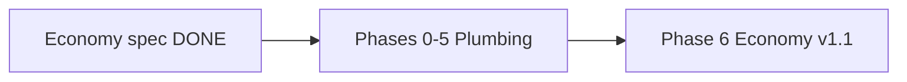

# Streaming System Rework — Master Plan

**Status:** **Milestones A + B live** (HTTP gateway R1–R10, Economy v1.1 on server).  
**Last updated:** July 2026  

Single implementation roadmap for two coupled reworks:

1. **Milestone A (Phases 0–5):** Streamer.bot HTTP gateway — thin ~9 actions, fat `server.py`
2. **Milestone B (Phase 6):** Economy v1.1 — server/Python only, no Streamer.bot action rebuild

**Economy spec (rules, tuning, analysis):** [Chat Command Economy v1.md](Chat%20Command%20Economy%20v1.md) — do not duplicate analysis tables here.

**Related:** [archive/streamerbot-points-from-scratch.md](archive/streamerbot-points-from-scratch.md), [fard-system.md](fard-system.md), [summon-march-system.md](summon-march-system.md), [streaming-setup-guide.md](streaming-setup-guide.md)

---

## Sequence



| Milestone | Cutover | Economy rules |
|-----------|---------|---------------|
| **A — Plumbing** | Offline session (Phase 4) | **Was:** 1 pt/msg, 30s CD → **now v1.1** |
| **B — Economy v1.1** | Server + config (Phase 6) | **Live:** 2 pt/20s, 500 cap, `!bank`, reset, 4× donations |

**Phase 4 success gate:** Live stream on **current** economy before starting Phase 6.

---

## Locked decisions

| Decision | Choice |
|----------|--------|
| Sequence | Design (done) → Plumbing (Phases 0–5) → Economy v1.1 (Phase 6) |
| Plumbing earn | **Historical:** 1 pt/msg, 30s CD during build → **live v1.1** |
| v1.1 cutover | **Separate** after plumbing is live + smoke-tested |
| Streamer.bot target | ~9 actions (router + First Words OBS + passive + 3 donations + lifecycle + spend toggle + presentation) |
| Plumbing migration | Offline cutover for gateway |
| v1.1 migration | Config deploy + one-time balance migration script |
| Chat copy | Server returns final `message` strings |
| `!doublepoints` | Twitch `isBroadcaster` only |
| `fard_used` / first words | Server `session_state.json` |
| First Words | Points on server; **First Words trigger stays in SB** for OBS only |
| `!` parsing | Server parses `rawMessage` (e.g. `!spawn rat`) |
| Command registry | Delete per-command Streamer.bot entries; router handles all |
| `spend_disabled.txt` | Keep — Stream Deck writes file; server reads it |
| Auth | Localhost-only for now |

---

## Problem

Today ~40 Streamer.bot actions each run a 3-step pipeline:

1. **Run Program** — `python points_command.py <cmd> …`
2. **Execute C#** — read `spawn_result.txt`, set variables
3. **Platform branch** — `%commandSource%` → Twitch vs YouTube reply

Earn logic lives in Streamer.bot C#; spend/donate costs live in `points_config.json` and Python. Economy rules are split across three places. Any change means hand-editing many actions and apply guides.

**Goal:** One service owns points logic; Streamer.bot owns chat I/O and presentation only.

---

## Target architecture

```
Viewer chat / donations
        ↓
Streamer.bot (~9 actions: triggers + presentation only)
        ↓
POST /api/chat-command  →  server.py  →  points logic + game WS :5001
        ↓
JSON { ok, message, pts, presentation? }
        ↓
Streamer.bot: chat reply + optional OBS/sound (presentation queue)
```

**Removed from live path:** `spawn_result.txt`, `donation_result.txt`, earn C# blocks, per-command C# parsers.

---

## Target Streamer.bot inventory (~9 actions)

| # | Action | Trigger | Responsibility |
|---|--------|---------|----------------|
| 1 | **Chat router** | Message Received (Twitch + YouTube) | All `!` commands + non-command earn via HTTP |
| 2 | **First Words presentation** | First Words (platform trigger) | OBS overlay + sound only — **not** points |
| 3 | **Passive earn** | Present Viewers | `type: earn.passive` |
| 4 | **Cheer** | Twitch Cheer | `type: donation.cheer` or `/api/donation/cheer` |
| 5 | **Super Chat** | YouTube Super Chat | `type: donation.superchat` or `/api/donation/superchat` |
| 6 | **Gift** | Gift sub / gift membership | `type: donation.gift` or `/api/donation/gift-membership` |
| 7 | **Stream started** | Stream Started | `POST /api/session/reset` |
| 8 | **Spend toggle** | Stream Deck Action Switch | `SpendToggle.cs` → `spend_disabled.txt` |
| 9 | **Presentation** | Sub-action from router / First Words | OBS flashes, sounds, GDI text (`!fard`, etc.) |

**Delete:** Actions 04–31, 36–37, 40 and all matching **Command** registry entries (`!spawn`, `!heal`, …).

### First Words split

| Path | Trigger | Does |
|------|---------|------|
| Points | Chat router (`earn.message`) | Server detects first message, awards +5 with multipliers |
| OBS | **First Words** trigger (Action 2) | OBS overlay + sound on **Default / presentation queue** |

The First Words trigger stays in Streamer.bot because OBS presentation requires it. Points logic moves to the server so First Words action has **no** C# earn block and **no** blocking queue wait.

**Ordering note:** On a user's first message, Message Received (router) and First Words may both fire. Server `first_words` idempotency prevents double +5.

---

## API contract

### Endpoints

| Method | Path | When |
|--------|------|------|
| `POST` | `/api/chat-command` | All chat, earn, spend, query, meta |
| `POST` | `/api/session/reset` | Stream Started (Action 7) |
| `POST` | `/api/session/end` | Stream Offline + debounce (Phase 6) |
| `POST` | `/api/donation/*` | Optional — existing donation routes still work |

Base URL: `http://127.0.0.1:5000`

### Request (router — thinnest Streamer.bot body)

```json
{
  "rawMessage": "!spawn rat",
  "username": "viewer1",
  "platform": "twitch",
  "context": {
    "isSubscribed": true,
    "isMember": false,
    "isBroadcaster": false,
    "bits": 0
  }
}
```

Server parses `rawMessage`:

- Starts with `!` → spend, query, or meta command + args
- Otherwise → `earn.message`

Donation actions may use typed requests instead:

```json
{
  "type": "donation.cheer",
  "username": "viewer1",
  "platform": "twitch",
  "context": { "bits": 100, "isSubscribed": true }
}
```

### Response

```json
{
  "ok": true,
  "message": "@viewer1 — Spawned a rat! You have 42 points left.",
  "pts": 42,
  "earned": 0,
  "extra": { "command": "spawn", "monster": "rat" },
  "presentation": null
}
```

Silent earn (no chat spam):

```json
{
  "ok": true,
  "message": null,
  "pts": 106,
  "earned": 2,
  "presentation": null
}
```

Presentation hint (`!fard`):

```json
{
  "ok": true,
  "message": null,
  "pts": 42,
  "presentation": {
    "obs": ["GROUP_Farder_H", "GROUP_Farder_V"],
    "sound": "fart-with-reverb.mp3",
    "gdi": { "file": "totalfard.txt", "increment": 1 },
    "chat": "@user used their fard! +N min of 2× for everyone."
  }
}
```

| Field | Meaning |
|-------|---------|
| `ok` | Success / failure |
| `message` | Chat text to send; `null` = stay silent |
| `pts` | Remaining spendable balance |
| `earned` | Points added this call (earn/donation) |
| `extra` | Command-specific payload for logging/debug |
| `presentation` | Optional OBS/sound/GDI hints for Action 9 |

---

## Server implementation

### New / changed modules

| Piece | Location | Notes |
|-------|----------|-------|
| `/api/chat-command` | `server.py` | Single entry; dispatches by parsed message or `type` |
| Dispatcher | `chat_command.py` | **New** — earn, spend, query, meta routing |
| Earn logic | `chat_command.py` or `earn.py` | Port from Streamer.bot C# Actions 01–03 |
| Session state | `session_state.json` | Per-stream: `fard_used`, `first_words`, summon counts |
| Message catalog | `chat_messages.py` or JSON | All viewer-facing strings (ported from scratch doc) |
| Refactored spend | `points_command.py` | Return structured `ChatResult`; optional legacy file mode during dev |

### Earn rules — Phase 1–5 (current, not v1.1)

| Source | Rate | Notes |
|--------|------|-------|
| Chat message | +1 | 30 s cooldown per user |
| Passive tick | +1 | Every 60 s; shares `lastEarn` with chat |
| First Words | +5 | Once per user per stream; server tracks in `session_state.json` |

**Config keys stubbed for v1.1** (use current defaults in Phase 1):

```python
points_per_message = 1   # v1.1 → 2
chat_cooldown_sec = 30   # v1.1 → 20
```

**Multipliers (chat, passive, first words):**

```
effective = base × (global2x ? 2 : 1) × (topSummoner ? 2 : 1) × (subOrMember ? 2 : 1)
```

Max 8× on chat earn. Donation multipliers unchanged until Phase 6.

### Session state (`session_state.json`)

Reset on Stream Started (Action 7 → `POST /api/session/reset`):

```json
{
  "fard_used": { "viewer1": true },
  "first_words": { "viewer2": true },
  "stream_started_at": 1720000000
}
```

### Command routing (server-side)

| Parsed command | Handler |
|----------------|---------|
| `spawn`, `champion`, `gold`, … | Existing `cmd_*` spend functions |
| `points` | Balance query |
| `toppoints` | Top-3 query |
| `fard` | Meta: extend `double_points_end.txt`, return `presentation` |
| `summon` | Meta: existing summon-march logic |
| `doublepoints` | Meta: Twitch `isBroadcaster` only, extend global 2× |
| `bank` | Phase 6 — `cmd_bank` |
| Unknown `!foo` | `ok: false`, helpful error message |

### Meta commands

| Command | Server | Streamer.bot |
|---------|--------|--------------|
| `!fard` | Gate via `fard_used`, extend timer, bump counter | Presentation action: OBS + sound from response |
| `!summon` | `summon_march_post.py` logic inlined or called | None |
| `!doublepoints` | Twitch broadcaster check, extend timer | None |

---

## Streamer.bot implementation

### Action 1: Chat router

**Trigger:** Message Received (Twitch + YouTube)  
**Queue:** Blocking points queue (same as today's spend/earn queue)

**Sub-actions:**

1. **Run a Program (curl)** — `POST /api/chat-command` (body from `chat_command_body.json`)
   - Body: `rawMessage`, `username`, `platform`, `context` (sub/member/broadcaster flags)
   - Timeout: **12 s**
2. **Parse JSON** → `%apiOk%`, `%apiMessage%`, `%apiPts%`, `%apiPresentation%`
3. **If presentation** → Run Action 9 on **Default / presentation queue** (non-blocking)
4. **If message not empty:**
   - `platform == youtube` → YouTube Message
   - `platform == twitch` → Twitch Message

No Run Program. No C# file parsing.

### Action 2: First Words presentation

**Trigger:** First Words (Twitch + YouTube)  
**Queue:** **Default / presentation queue** (never blocking spend queue)

**Sub-actions:** OBS overlay + sound only (existing First Words visuals). Points awarded by router on server.

### Action 9: Presentation (shared)

Called by router (and optionally First Words):

- Show/hide OBS sources from `presentation.obs[]`
- Play `presentation.sound`
- Update GDI files from `presentation.gdi`

---

## Phase 0 — Prep (~2–4 h)

- [x] Map every current action → delete / merge / keep — [archive/phase-0-action-inventory.md](archive/phase-0-action-inventory.md)
- [x] Port chat message strings to server catalog — `Lastest UI/chat_messages.py`
- [x] Confirm OBS source names — `Lastest UI/presentation_config.py` (`GROUP - Farder`, `totalfard.txt`, `fart-with-reverb.mp3`)
- [x] Export backup of current Streamer.bot — fresh export saved; see [README-backup.md](../Lastest%20UI/streamerbot/README-backup.md)
- [x] Write API test script — `Lastest UI/test_chat_command_api.ps1` (covers [test matrix](#test-matrix-minimum); chat-command cases activate in Phase 1)

---

## Phase 1 — Server plumbing (~2–3 days)

**Sub-order:**

1. Refactor `Lastest UI/points_command.py` — `cmd_*` → structured `ChatResult`; keep `LEGACY_FILE_MODE`
2. Add `Lastest UI/chat_command.py` — spend + query paths first
3. Add `POST /api/chat-command` + `POST /api/session/reset` in `Lastest UI/server.py` (pattern: donation wrappers ~line 2608)
4. Port earn from Streamer.bot C# (1pt/30s) with config keys stubbed for v1.1
5. Session state + meta (`!fard`, `!summon`, `!doublepoints`)
6. Manual tests via `curl` before Streamer.bot work

**Checklist:**

- [x] Implement `POST /api/chat-command`
- [x] Port earn logic from C# (current rates)
- [x] Add `session_state.json` + Stream Started reset endpoint
- [x] Refactor `points_command.py` to return JSON-shaped results
- [x] Keep `LEGACY_FILE_MODE` flag until cutover
- [x] Unit/manual tests via `curl` / `test_chat_command_api.ps1` (with server running)

---

## Phase 2 — Streamer.bot build (off-stream, ~4–6 h)

**Apply guide:** [streamerbot-http-gateway-apply.md](streamerbot-http-gateway-apply.md)  
**C# snippets:** `Lastest UI/streamerbot/phase2/`

- [x] Queues: blocking `points` + `presentation` configured
- [x] R1 Chat router (curl POST → parse → platform reply → optional R9)
- [x] R2 First Words OBS-only (no earn C#)
- [x] R3 Passive earn HTTP
- [x] R4–R6 Donations HTTP (`/api/donation/*`)
- [x] R7 Stream started → `/api/session/reset` (Twitch trigger)
- [x] R8 Spend Toggle (`SpendToggle.cs`; Action Switch both slots)
- [x] R9 Presentation (fard OBS + sound)
- [x] R1–R9 enabled; old actions disabled at cutover
- [x] All HTTP URLs use `127.0.0.1:5000` only

---

## Phase 3 — Off-stream testing (~1–2 days)

- [x] Full [test matrix](#test-matrix-minimum) passes
- [x] No reads of `spawn_result.txt` / earn C# in new path
- [x] First Words OBS fires on presentation queue without waiting on spawns
- [x] `!fard` OBS + sound still works via `presentation`
- [x] 12 s timeout returns error message to chat on game hang

---

## Phase 4 — Offline cutover (~1–2 h)

- [x] Stop stream / deploy / enable R1–R9 / disable old actions
- [x] Smoke test (`phase3_rapid_test.ps1`, live chat)
- [x] Old Streamer.bot install not required for live path

**Success gate:** Stream at least once on **current** economy before Phase 6.

---

## Phase 5 — Cleanup + replicability (~4–6 h)

- [x] Remove `LEGACY_FILE_MODE` and file handoff from production path (`run_points_command`)
- [x] Rewrite [archive/streamerbot-points-from-scratch.md](archive/streamerbot-points-from-scratch.md) for 9-action model (superseded header + archive)
- [x] Fard + summon consolidated in [Streamer.bot meta commands](#streamerbot-meta-commands-fard--summon) below
- [x] Generate `Lastest UI/streamerbot/shatter-the-streamer-export-0.2.0` (**manual** export — no `.txt` extension)
- [x] See [Replication appendix](#replication-appendix)

---

## Phase 6 — Economy v1.1 (server-only, after plumbing stable)

**Rules and rationale:** [Chat Command Economy v1.md](Chat%20Command%20Economy%20v1.md) — cap, bank, reset, donation 4×, analysis.

**No Streamer.bot action rebuild** except one thin addition: Stream Offline → `POST /api/session/end`.

### Tasks

| Task | File(s) | Notes |
|------|---------|-------|
| Flip earn rates | `points_config.json`, earn module in `chat_command.py` | 2 pt/msg, 20s CD |
| Chat cap + nudge | `chat_command.py` | 500 cap; reply on every blocked earn — see economy § Chat cap |
| `!bank` command | `points_command.py` → `cmd_bank` | preview / all / N forms |
| Two-bucket `!points` | message catalog | `Chat: X/500 \| Donor: Y` |
| Donation 4× cap | `donation_earn_multiplier()` in `points_command.py` | Replace 2× cap |
| Auto-bank + reset | `chat_command.py` or `session_reset.py` | `POST /api/session/end` with 4h debounce |
| Stream Offline trigger | Streamer.bot (thin) | POST `/api/session/end` — **only new SB wiring in v1.1** |
| Manual reset | Stream Deck | Same endpoint or `/api/session/reset?force=1` |
| Config keys | `points_config.json`, `load_config()` defaults, `points-config.html` | Keys from economy § Config keys |
| One-time migration | script in `Lastest UI/` | Excess chat >500 → 10% into donor |
| Doc sync | [Doc sync checklist](#doc-sync-checklist-phase-6) | Mark economy doc **Implemented** |

**Apply guide:** [economy-v11-apply.md](economy-v11-apply.md)

### Phase 6 cutover checklist

- [x] Deploy server + config only (no SB action rebuild except Stream Offline)
- [x] Run migration script; announce on stream *(skipped — full balance wipe for go-live)*
- [x] Smoke test: cap, `!bank`, reset, 4× donation cap, member auto-bank
- [x] Wire Stream Offline → `POST /api/session/end` (R10)
- [x] Update viewer panel / Discord one-liner (economy § Viewer-facing one-liner)

### Config keys (Phase 6)

| Key | Default | Description |
|-----|---------|-------------|
| `chat_point_cap` | `500` | Max chat pts per user per stream |
| `bank_ratio_manual` | `0.10` | `!bank` conversion rate |
| `bank_ratio_auto` | `0.05` | Auto-bank on stream reset (regular) |
| `bank_ratio_auto_member` | `0.10` | Auto-bank on stream reset (subs/members) |
| `donation_multiplier_cap` | `4` | Max multiplier on donations |
| `points_per_message` | `2` | Chat earn base |
| `chat_cooldown_sec` | `20` | Per-user message cooldown |
| `reset_debounce_hours` | `4` | Hours after Stream Offline before auto reset |

Mirror defaults in `points_command.py` `load_config()` and `points-config.html` `value=` fallbacks.

---

## Key files

| File | Phases 1–5 | Phase 6 |
|------|------------|---------|
| `Lastest UI/server.py` | `/api/chat-command`, `/api/session/reset` | `/api/session/end` (debounced) |
| `Lastest UI/chat_messages.py` | Phase 0 — message catalog | v1.1 bank/cap strings |
| `Lastest UI/presentation_config.py` | Phase 0 — OBS/GDI/sound keys | Unchanged |
| `Lastest UI/chat_command.py` | New — dispatcher, earn port | Cap, bank routing, reset |
| `Lastest UI/points_command.py` | Refactor returns | `cmd_bank`, 4× donation cap |
| `Lastest UI/session_state.json` | New | Unchanged |
| `Lastest UI/points_config.json` | Stub keys | Full v1.1 values |
| `docs/Chat Command Economy v1.md` | Spec reference | Mark **Implemented** |

---

## Action inventory

| Current action | Disposition |
|----------------|-------------|
| 01 Earn (chat) | **Delete** → Chat router + server `earn.message` |
| 02 Earn (passive) | **Replace** → Action 3 HTTP only |
| 03 First Words (C#) | **Delete C#** → server awards; keep **Action 2** for OBS |
| 04 `!points` | **Delete** → router |
| 05 `!toppoints` | **Delete** → router |
| 06–18, 25–31, 36–37 Spend commands | **Delete** → router |
| 19 `!doublepoints` | **Delete** → router (server gate) |
| 20–21 Cheer / Super Chat | **Replace** → Actions 4–5 HTTP |
| 22 Stream Started | **Replace** → Action 7 + server session reset |
| 23–24 Spend off/on | **Merged** → Action 8 (`R8 - Spend Toggle`) |
| 40 Gift | **Replace** → Action 6 HTTP |
| fard action | **Delete** → router + Action 9 presentation |
| summon action | **Delete** → router |

---

## Test matrix (minimum)

| Category | Cases |
|----------|-------|
| Spend | Each command: ok, insufficient pts, spend disabled, game timeout |
| Args | `!spawn rat`, `!gold 50`, bare `!wand` |
| Query | `!points`, `!toppoints` |
| Earn | +1 message, cooldown skip, passive, first words +5 |
| Multipliers | Global 2×, top summoner, sub/member, stacked |
| Meta | `!fard` once, twice (silent), `!summon`, `!doublepoints` non-streamer blocked |
| Donations | Cheer, Super Chat, gift — multiplier args |
| Platform | Twitch + YouTube for router replies |
| First Words | OBS fires; points awarded once only |
| Concurrency | Rapid double `!spawn` — second serializes cleanly |

**Phase 6 additions:** cap nudge, `!bank` forms, stream reset + auto-bank, 4× donation cap, member auto-bank at 10%.

---

## Success criteria

**Plumbing done (Phase 5):**

- ~9 Streamer.bot actions maintained (not ~40)
- New spend command = Python + config only
- No `spawn_result.txt` in production path

**Economy v1.1 done (Phase 6):**

- Active chatters cap in ~83 min; chat resets on stream end; `!bank` live
- Donations beat grind ($1 @ 4× beats max bank path)
- [Chat Command Economy v1.md](Chat%20Command%20Economy%20v1.md) marked **Implemented**

---

## Doc sync checklist (Phase 6)

- [x] `docs/Chat Command Economy v1.md` — mark **Implemented**
- [x] `COMMANDS.md` — `!bank`, cap/reset wording, donation 4× cap, member auto-bank
- [x] `docs/user-facing-summary.md`
- [x] `docs/twitch-panel.md`
- [x] `docs/youtube-description.md`
- [x] `docs/archive/streamerbot-points-from-scratch.md` — cap, 2 pt/20s, 4× donations, bank, reset
- [x] `docs/stream-info-commands.md` — native `!kesha` / `!seed` / `!mimic` / `!challenge` (outside R1)
- [x] `docs/fard-system.md`, `docs/summon-march-system.md` — R1/R9 architecture (July 2026)
- [x] `docs/streaming-setup-guide.md`, `docs/project-structure.md` — documentation map + gateway-first setup

---

## Streamer.bot meta commands (fard + summon)

Consolidated from [archive/streamerbot-fard-rework-apply.md](archive/streamerbot-fard-rework-apply.md) and [archive/streamerbot-summon-march-apply.md](archive/streamerbot-summon-march-apply.md). **No separate Streamer.bot actions** — both route through **R1**.

### `!fard`

| Step | Where |
|------|--------|
| Earn / once-per-stream gate | `chat_command.py` → `handle_fard()` + `session_state.json` |
| Chat line | Server `message` (R1) + optional R9 OBS/sound; repeat = already-used reply |
| OBS + sound | **R9** on `presentation` queue (`R9LoadContext.cs` globals bridge) |
| 2× extension | Server writes `double_points_end.txt` |

Full spec: [fard-system.md](fard-system.md). Build steps: apply guide **Step 7 (R9)**.

### `!summon` (march overlay)

| Step | Where |
|------|--------|
| Cooldown + monster pick | `chat_command.py` → `handle_summon()` |
| Queue event | `POST /api/summon-march` (from server, not Streamer.bot) |
| Leaderboard | `top_summoner.txt` (server); 2× personal earn in `points_command.py` |
| Visual | Godot companion polls `GET /api/summon-march` |
| Sound | API `presentation` with `kind: "summon"` — `ParseChatResponse.cs` plays `SUMMON_SOUND` (see `presentation_config.py`) |

Full spec: [summon-march-system.md](summon-march-system.md). Re-paste `ParseChatResponse.cs` after pulling summon sound changes.

Legacy apply guides remain for historical reference; do not add new per-command actions.

---

## Replication appendix

For streamers who want to replicate the setup without author-specific paths:

### Requirements

- Python 3.x
- Streamer.bot (Twitch + optional YouTube)
- OBS (scenes referenced in `presentation` hints)
- Game + overlay server from this repo

### Path rules

| What | Rule |
|------|------|
| Web Request URL | Always `http://127.0.0.1:5000/api/chat-command` — no file paths |
| Working Directory | **Not used** in new model (no Run Program) |
| `spend_disabled.txt` | `R8 - Spend Toggle` (Stream Deck Action Switch) writes/deletes `Lastest UI/spend_disabled.txt` |
| OBS source names | Must match `presentation.obs` keys in server responses or config |

### Setup steps (summary)

1. Clone repo; `pip install` overlay deps; run `python server.py` in `Lastest UI`
2. Enable game streaming (WS :5001)
3. Import `shatter-the-streamer-export-0.2.0.txt`
4. Map OBS source names in R9 to your scenes (see apply guide)
5. Connect Twitch/YouTube in Streamer.bot
6. Off-stream smoke test: `Lastest UI/phase3_rapid_test.ps1`

### Customization without Streamer.bot edits

| Change | Where |
|--------|-------|
| Command costs | `points_config.json` / `/points-config` UI |
| New spend command | `points_command.py` + server route table |
| Chat messages | Server message catalog |
| Earn rates (post-v1.1) | `points_config.json` + server earn module |
| OBS presentation | `presentation` payload in server meta handlers |

---

## Effort estimate

| Phase | Effort |
|-------|--------|
| 0 Prep | 2–4 hours |
| 1 Server | 2–3 days |
| 2 Streamer.bot build | 4–6 hours |
| 3 Test | 1–2 days |
| 4 Cutover | 1–2 hours |
| 5 Cleanup | 4–6 hours |
| 6 Economy v1.1 | 2–4 days |

---

## Open items

- [ ] Exact OBS source names for Action 9 / `presentation.obs` keys
- [ ] Whether donation actions call `/api/chat-command` or existing `/api/donation/*` (either works)
- [ ] First Words: confirm platform trigger list (Twitch + YouTube) matches current setup
- [ ] Stream Offline → `/api/session/end` debounce implementation (server-side vs SB timer)

---

## Risk notes

- **Earn port accuracy** — highest test burden; compare side-by-side with old C# for 1–2 test users before cutover
- **First Words race** — Message Received and First Words may fire together; server `first_words` idempotency prevents double +5
- **12s HTTP timeout** — must exceed `GAME_COMMAND_TIMEOUT` (9s) in `points_command.py`
- **Two cutovers** — keep plumbing (Phase 4) and economy (Phase 6) separate to limit failure modes
