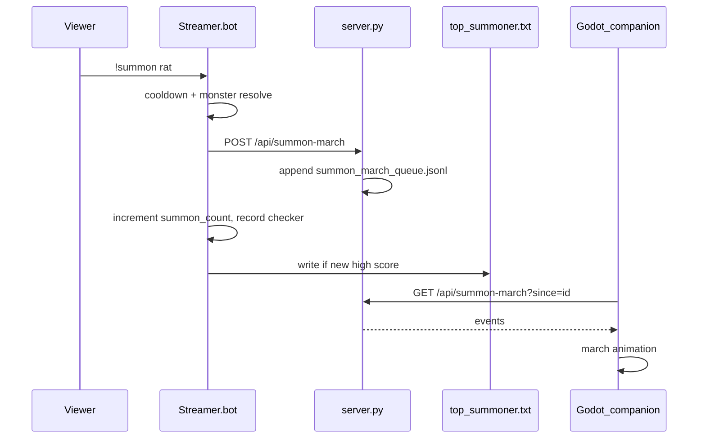

# Summon March System

Free, spammable chat command: viewers use `!summon` (1 min per-user cooldown) to queue a monster march on the **Godot companion app** overlay. Session leaderboard tracks the **top summoner**, who earns **personal 2× points** on chat, passive, and donations — replacing the removed top farder bonus.

**Apply Streamer.bot:** [streamerbot-summon-march-apply.md](streamerbot-summon-march-apply.md). **Points C#:** [streamerbot-points-from-scratch.md](streamerbot-points-from-scratch.md). **Related:** [fard-system.md](fard-system.md), [streaming-setup-guide.md](streaming-setup-guide.md).

---

## Overview

| Property | Value |
|----------|-------|
| **Platform** | Streamer.bot + overlay server + Godot companion (visual) |
| **Commands** | `!summon`, `!topsummoner`, `!mysummons` |
| **Cost** | Free |
| **Cooldown** | 60 s per user (Streamer.bot command cooldown) |
| **Monster** | Optional arg (`!summon rat`); random from spawn pool if omitted |
| **Top summoner** | Highest session summon count → `top_summoner.txt` → 2× personal earn |
| **Game impact** | None — companion overlay only (not in-game spawn) |

---

## Chat commands

| Command | Aliases | Behavior |
|---------|---------|----------|
| `!summon` | — | Queue monster march; 60 s cooldown |
| `!topsummoner` | — | Echo current session leader |
| `!mysummons` | — | Your summon count this stream |

---

## Architecture



---

## Data

### Temp globals (Streamer.bot — session-scoped)

| Variable | Purpose |
|----------|---------|
| `summon_march_last_%userName%` | Unix timestamp of last successful summon |
| `summon_count_%userName%` | Successful summons this stream |
| `top_summon_score_ever` | Highest personal count this stream |
| `totalsummons` | Session total → `totalsummons.txt` |

### Files (`Lastest UI/`)

| File | Role |
|------|------|
| `top_summoner.txt` | `Top Summoner: DisplayName - N` — points 2× + OBS |
| `totalsummons.txt` | `Total Summons: N` — session count for OBS |
| `summon_march_queue.jsonl` | Durable event log (max 500 in memory) |

### Queue event (JSON)

```json
{"id":"uuid","ts":1710000000,"username":"viewer","monster":"rat","layout":"horizontal"}
```

---

## HTTP API (`server.py`)

| Route | Method | Purpose |
|-------|--------|---------|
| `/api/summon-march` | POST | Streamer.bot enqueues summon `{username, monster, layout?}` |
| `/api/summon-march` | GET | Godot polls `?since=<event_id or unix_ts>` |
| `/api/top-summoner` | GET | `{username, count, display, has_leader}` for OBS |

Monster must be in the same whitelist as in-game spawn (`rat`, `albino`, `snake`, … `scorpio`).

---

## Points integration

**Multiplier (chat + passive + first words):**

```text
mult = (doublePoints ? 2 : 1) × (topSummoner ? 2 : 1) × (subOrMember ? 2 : 1)
```

- **Earn Points C#** reads `top_summoner.txt` via `IsTopSummoner(userKey)`.
- **Donations** — `points_command.py` reads the same file via `is_top_summoner(username)`; no Streamer.bot CLI flag needed.

**Tie rule:** Leader updates only when count is **strictly greater** than the previous high. Tied users keep the incumbent leader.

**Separate from fard:** `!fard` = once/stream, extends **global** 2× timer. `!summon` = repeatable visual + **personal** 2× race.

---

## Godot companion

**Project:** `C:/Users/dalto/Documents/spd-companion-3` (**SPD Companion 3**) — autoload `SummonPollService`, `CanvasLayerSummonMarch`, uses `assets/mobicons/` via `MobCommandArt`. Godot code is **not** in this repo.

**Full spec:** [godot-summon-march-brief.md](godot-summon-march-brief.md)

1. Poll `GET http://127.0.0.1:5000/api/summon-march?since=<lastEventId>` every 200–500 ms.
2. Dedupe by event `id`.
3. For each event: spawn monster sprite off-screen, tween across, despawn.
4. Map `monster` string → sprite (same names as spawn whitelist; alias `dm100` → “DM-100” for display if desired).
5. Optional: `GET /api/top-summoner` for crown/badge overlay.
6. Godot runs as separate OBS source (Window Capture / Game Capture), not inside the HTML overlay.

---

## Known limitations

| Issue | Notes |
|-------|-------|
| Session-scoped counts | Resets when Streamer.bot restarts |
| Cooldown reset on SB restart | Same as fard temp globals |
| Godot offline | Events queue in jsonl; catch up on start (cap 500) |
| Concurrent users | Each user 1/min; many users = busy screen |
| server.py required | POST fails if overlay server not running |
| Multiplier stacking | Top summoner + global 2× + sub = up to 8×/message |

---

## Test checklist

| Test | Expected |
|------|----------|
| `!summon` | Queue entry; totals +1; chat OK |
| `!summon` within 60 s | Cooldown rejection |
| `!summon badmob` | Invalid monster rejection |
| `!summon` no arg | Random valid monster |
| Two users spam | Higher count in `top_summoner.txt`; 2× points |
| Overtake leader | Previous leader loses 2× |
| `!topsummoner` | Echoes file |
| Donation as top summoner | 2× base (stacks with other bonuses) |
| server.py stopped | Command fails at HTTP step |
| GET `/api/summon-march` | Returns queued events |
